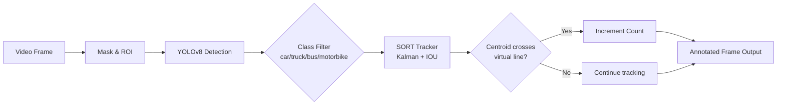

<h1 align="center">Car Counter using OpenCV</h1>

<p align="center"><em>Real-time vehicle detection and counting from a video stream using YOLOv8 + SORT tracking</em></p>

<p align="center">
  
  
  
  
</p>

---

## Overview

Car Counter processes a traffic video and counts vehicles (cars, trucks, buses, motorbikes) as they cross a configurable virtual line. Each frame is passed through a **YOLOv8** detector, and detected bounding boxes are handed off to the **SORT** (Simple Online and Realtime Tracking) algorithm, which maintains consistent IDs across frames using a Kalman filter. A vehicle is registered as counted exactly once when its centroid crosses the line.

A binary road-region mask (`mask.png`) focuses detection on the relevant lane area, and a UI graphics overlay (`graphics.png`) is composited onto each output frame.

---

## Features

- YOLOv8 (`yolov8l`) object detection for robust multi-class vehicle recognition
- SORT multi-object tracker with Kalman filter — persistent IDs across frames
- Virtual counting line: configurable pixel coordinates, turns green on each new count
- Region-of-interest masking to suppress off-road false positives
- Overlay UI with running counter displayed in the frame
- Supports any OpenCV-compatible video source (file or IP camera)

---

## Architecture



---

## Project Structure

```
Car-Counter-using-OpenCV/
├── Car-Counter.py   # Main script — detection, tracking, counting loop
├── sort.py          # SORT multi-object tracker (Bewley et al., 2016)
├── cars.mp4         # Sample traffic video
├── mask.png         # Binary road-region mask
└── graphics.png     # UI overlay graphic
```

---

## Quick Start

### Prerequisites

- Python 3.9+
- A YOLOv8 weights file (e.g. `yolov8l.pt`) from [Ultralytics](https://github.com/ultralytics/ultralytics)

### Install dependencies

```bash
pip install ultralytics opencv-python cvzone filterpy scikit-image lapjv
```

> `lapjv` is optional but recommended for faster assignment in SORT. If unavailable, it falls back to `scipy`.

### Configure paths

Edit the hardcoded paths at the top of `Car-Counter.py` before running:

```python
cap = cv2.VideoCapture("cars.mp4")          # path to your video
model = YOLO("yolov8l.pt")                  # path to YOLOv8 weights
mask = cv2.imread("mask.png")               # road-region mask
imgGraphics = cv2.imread("graphics.png", cv2.IMREAD_UNCHANGED)
```

### Run

```bash
python Car-Counter.py
```

A window opens showing the annotated video stream. The running vehicle count is overlaid in the frame. Press any key to advance or close the window to stop.

---

## How It Works

1. Each frame is bitwise-AND'd with `mask.png` to restrict detection to the road region.
2. YOLOv8 runs inference on the masked frame; detections with class `car`, `truck`, `bus`, or `motorbike` above 0.3 confidence are kept.
3. Filtered bounding boxes are passed to the SORT tracker, which returns boxes annotated with persistent object IDs.
4. For each tracked box, the centroid is computed. When the centroid crosses the configured horizontal line (`y ≈ 297, x ∈ [400, 673]`), the vehicle ID is appended to `totalCount` (checked for duplicates), incrementing the counter.

---

## License

Distributed under the [Apache License 2.0](LICENSE).  
`sort.py` is separately licensed under the GNU GPL v3 (© Alex Bewley).
